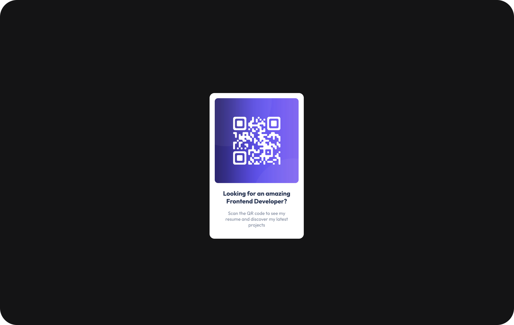

# Frontend Developer QR Code

## Description

Seeking an exceptional Frontend Developer?

Look no further than my interactive QR code portfolio. This unique design seamlessly blends functionality and sustainability, allowing you to explore my skills and experience without the need for paper.

## Live Demo

You can experience Frontend Developer QR Code and explore by visiting the live demo [Live Demo](https://codenaud.github.io/qr/)

## Features

- **Interactive QR Code:** Scan the QR code to instantly access my online portfolio, eliminating the need for printed resumes.

- **Sustainable Approach:** By utilizing a digital portfolio, I'm actively contributing to a greener environment, reducing paper waste, and promoting eco-conscious practices.

- **Front-End Expertise:** Discover my proficiency in HTML, CSS, and JavaScript, along with my ability to create user-friendly and engaging interfaces.

## Technologies Used

Travel Landing project has been developed using the following technologies:

- HTML5: The foundation of my portfolio's structure and content, ensuring compatibility across various web browsers.
- CSS3: Responsible for the captivating styles and visual effects that bring my portfolio to life.
- JavaScript: Adds an extra layer of interactivity and responsiveness, enhancing the user experience.

## Badges/Shields

Dev Skills

Build with

## Acknowledgments

This project would not have been possible without the incredible community of developers and designers who continually inspire and support each other.

## About Me

I'm a junior frontend developer passionate about HTML, CSS and JavaScript, who wants to share the work of all the people who have helped me on the way to being able to dedicate myself to what I like the most.

## Contact

If you have any questions or suggestions, do not hesitate to contact me through my email: [codenaud@gmail.com](mailto:codenaud@gmail.com)

Happy coding! 🚀
